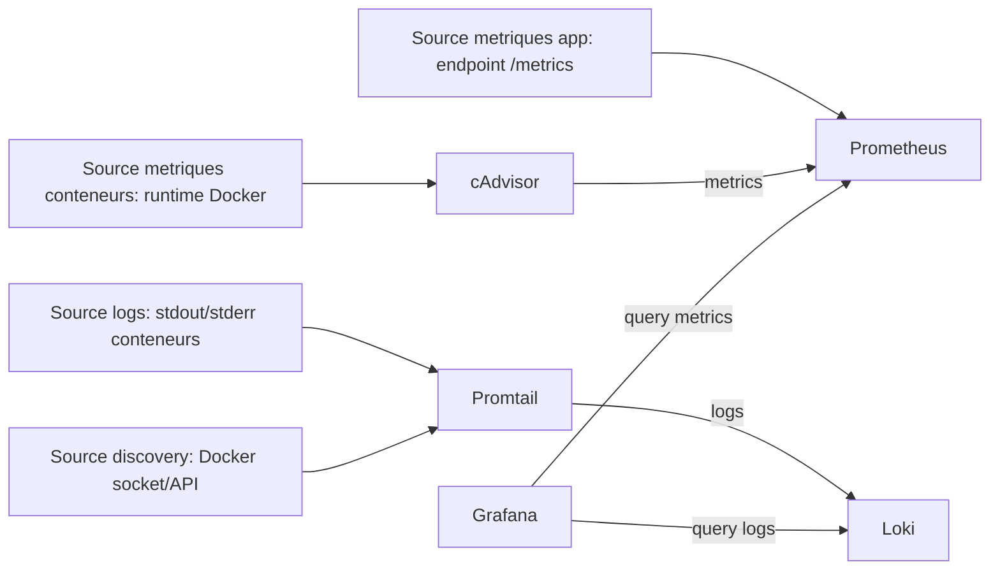
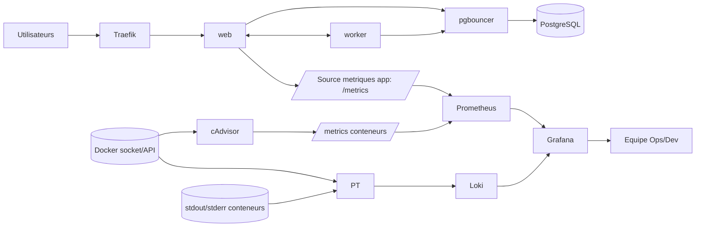

# POWERPOINT TEMP - Monitoring & Scaling CintaFactory

## Slide 1 - Titre
**Monitoring & Scaling de CintaFactory**  
Architecture, observabilite, capacite et fiabilite

## Slide 2 - Pourquoi investir dans le monitoring et le scaling ?
- Garantir la disponibilite de l'application en detectant rapidement les incidents.
- Eviter que les traitements lourds degradent l'experience utilisateur.
- Dimensionner la plateforme selon la charge reelle (CPU, memoire, reseau, files async).
- Reduire le MTTR (temps moyen de resolution) grace a une correlation metriques + logs.
- Soutenir une croissance progressive sans refonte brutale de l'architecture.

## Slide 3 - Vision d'ensemble
- **Ingress**: Traefik recoit le trafic et route vers `web`.
- **Applicatif**: `web` (sync) + `worker` (async) se partagent les responsabilites.
- **Donnees**: pgbouncer protege PostgreSQL; SeaweedFS gere les fichiers; ClamAV securise les uploads.
- **Observabilite**: Prometheus + cAdvisor (metriques), Loki + Promtail (logs), Grafana (visualisation).
- **Reseaux separes**: `edge`, `app`, `data`, `app_monitoring` pour limiter l'exposition et les mouvements lateraux.

## Slide 4 - Prometheus
**Pourquoi ce choix**  
- Standard de fait pour la collecte de metriques et les alertes en environnement conteneurise.

**Ce que ca fait dans CintaFactory**
- Scrape `web:/metrics`, `cadvisor:/metrics` et lui-meme.
- Evalue les regles d'alerte (ex: indisponibilite metriques, backlog async, erreurs 5xx).

**Comparaison (pro / con)**
- **Pro vs Zabbix/Nagios**: meilleur pour les metriques cloud-native et labels dynamiques.
- **Con vs Datadog/New Relic**: plus de gestion operationnelle (hebergement, retention, tuning) cote equipe.

**Licence**
- Apache License 2.0

## Slide 5 - Grafana
**Pourquoi ce choix**
- Outil central pour unifier visualisation metriques (Prometheus) et logs (Loki).

**Ce que ca fait dans CintaFactory**
- Dashboards: service overview, fiabilite/SLO, capacite/scaling, correlation logs, interactions architecture.
- Exploration ad hoc pendant les incidents (Explore).

**Comparaison (pro / con)**
- **Pro vs Kibana seul**: plus polyvalent multi-sources (Prometheus + Loki + autres).
- **Con vs solutions SaaS dashboarding**: maintenance locale et gouvernance des dashboards a assurer.

**Licence**
- AGPL-3.0 (Grafana OSS)

## Slide 6 - Loki + Promtail
**Pourquoi ce choix**
- Pipeline logs leger, aligne avec l'ecosysteme Grafana et peu couteux en indexation.

**Ce que ca fait dans CintaFactory**
- Promtail decouvre les conteneurs Docker, collecte stdout/stderr et pousse vers Loki.
- Loki stocke et rend interrogeables les logs (LogQL), avec labels `service`, `container`, `project`, etc.

**Comparaison (pro / con)**
- **Pro vs ELK complet**: empreinte plus faible et operation plus simple pour logs conteneurs.
- **Con vs ELK complet**: moins riche pour certaines analyses textuelles avancees/full-text massives.

**Licence**
- Loki: AGPL-3.0
- Promtail: AGPL-3.0

## Slide 7 - cAdvisor
**Pourquoi ce choix**
- Exporteur specialise pour metriques CPU/memoire/reseau au niveau conteneur.

**Ce que ca fait dans CintaFactory**
- Expose les metriques runtime des conteneurs, scrappees par Prometheus pour les dashboards capacite.

**Comparaison (pro / con)**
- **Pro vs scripts custom Docker stats**: schema metriques standard et integration native Prometheus.
- **Con vs eBPF avance (ex: Cilium/Hubble stack)**: granularite plus limitee selon les besoins tres bas niveau.

**Licence**
- Apache License 2.0

## Slide 8 - Traefik (scaling)
**Pourquoi ce choix**
- Reverse proxy moderne, simple a integrer en Docker Compose et adapte aux topologies avec replicas.

**Ce que ca fait dans CintaFactory**
- Point d'entree unique de la plateforme.
- Routage HTTP vers `web`, avec dashboard d'edge pour l'exploitation.

**Comparaison (pro / con)**
- **Pro vs Nginx brut**: configuration dynamique plus naturelle en environnement conteneurise.
- **Con vs Nginx/HAProxy experts**: moins de controle fin sur certains cas tres personnalises.

**Licence**
- MIT

## Slide 9 - Docker Compose + separation web/worker + pgbouncer (scaling)
**Pourquoi ce choix**
- Permet de separer trafic synchrone et traitements lourds asynchrones.

**Ce que ca fait dans CintaFactory**
- `web` gere UI/API; `worker` gere exports et jobs lourds hors chemin utilisateur.
- `pgbouncer` absorbe les pics de connexions DB et protege PostgreSQL.
- Compose facilite le scale horizontal de roles differents.

**Comparaison (pro / con)**
- **Pro vs monolithe non decoupe**: meilleure elasticite et isolation des charges.
- **Con vs Kubernetes**: moins d'automatisation native (autoscaling, scheduling avance, self-healing etendu).

**Licence**
- Docker Compose: Apache License 2.0
- PgBouncer: ISC
- PostgreSQL: PostgreSQL License

## Slide 10 - Django workers (focus scaling)
**Pourquoi c'est central**
- Les workers retirent les traitements lourds du chemin HTTP utilisateur.
- Ils permettent de scaler le traitement async independamment du front web.

**Ce que font les workers dans CintaFactory**
- Execution des jobs asynchrones (`exports.likec4`, `exports.drawio`, `exports.pdf`).
- Consommation de la file de jobs avec retries et gestion de dead-letter.
- Interaction avec les dependances techniques: `pgbouncer`, `seaweedfs`, `clamav`, exporters.

**Impact scaling concret**
- Le service `web` reste reactif meme en cas de forte charge d'exports.
- On peut augmenter uniquement les replicas `worker` lors des pics batch.
- Meilleure isolation des pannes: incident async != indisponibilite immediate de l'UI.

**Points de vigilance**
- Besoin de surveiller backlog, taux d'echec et temps de traitement.
- Necessite de bonnes politiques de retry/timeouts pour eviter l'engorgement.

## Slide 11 - Liens entre technologies (monitoring <-> scaling)
- Traefik distribue le trafic vers `web` (et futures replicas), ce qui influence directement la charge mesuree.
- `web` et `worker` exposent des signaux techniques (metriques app + etat queue async).
- cAdvisor observe l'usage conteneur (CPU/RAM/reseau) des services scales.
- Prometheus centralise ces metriques et declenche les alertes (saturation, cible down, backlog).
- Promtail capte les logs de chaque service et les envoie a Loki.
- Grafana correle metriques Prometheus et logs Loki pour diagnostiquer rapidement si le probleme vient:
  - du routage edge (Traefik),
  - de la saturation applicative (`web`/`worker`),
  - de la couche data (`pgbouncer`/DB),
  - ou d'une dependance (exporters, stockage, antivirus).

**Schema simple monitoring**

## Slide 12 - Exemple de lecture incident (storyline demo)
1. Alerte Prometheus: hausse erreurs 5xx + latence.
2. Dashboard Grafana capacite: CPU `web` eleve, backlog `worker` en hausse.
3. Logs Loki: timeout repetes vers un exporteur.
4. Action: augmenter replicas `worker`, verifier dependance impactee, ajuster seuils/timeouts.
5. Resultat: baisse backlog, retour des SLO et stabilisation du trafic.

## Slide 13 - Limites et axes d'amelioration
- Ajouter Alertmanager (notifications centralisees: Slack/Email/PagerDuty).
- Definir des SLO formels par parcours critique (latence, taux d'erreur, succes export).
- Automatiser davantage la capacite (tests de charge periodiques, runbooks). 
- Envisager un niveau orchestration superieur si besoin d'autoscaling avance.

## Slide 14 - Conclusion
- Le scaling et le monitoring sont traites comme un systeme unique, pas comme deux sujets separes.
- La combinaison Traefik + separation web/worker + pgbouncer absorbe la croissance.
- Le triptyque Prometheus/Loki/Grafana rend les decisions de capacite factuelles et rapides.
- Objectif final: une plateforme fiable, observable et evolutive.

## Annexe - Recap licences
- Prometheus: Apache-2.0
- Grafana OSS: AGPL-3.0
- Loki: AGPL-3.0
- Promtail: AGPL-3.0
- cAdvisor: Apache-2.0
- Traefik: MIT
- Docker Compose: Apache-2.0
- PgBouncer: ISC
- PostgreSQL: PostgreSQL License
