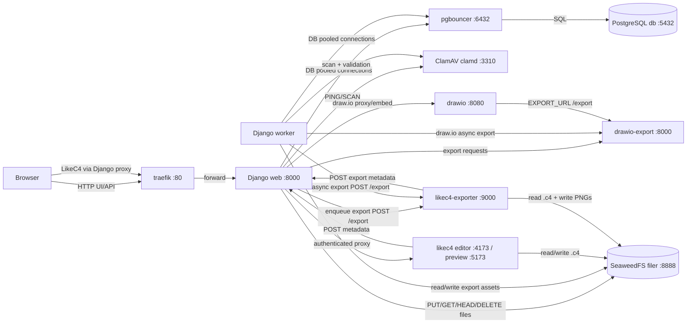
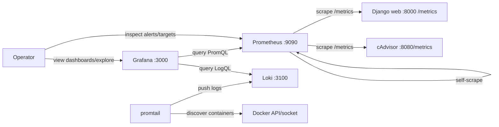
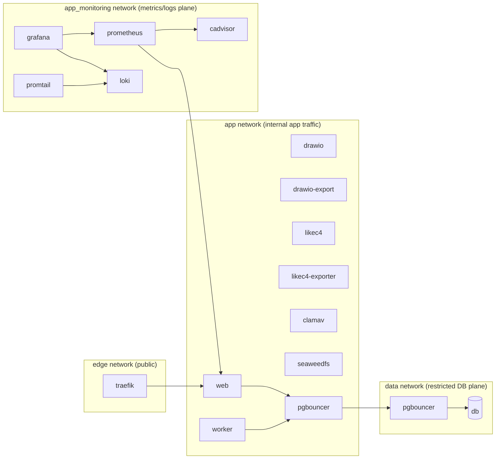
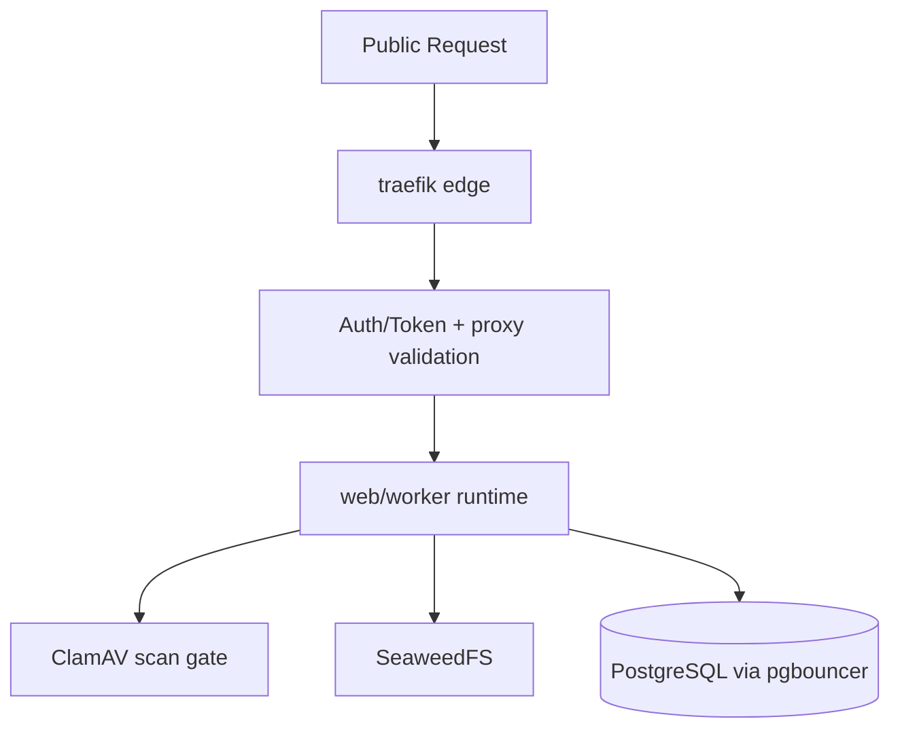
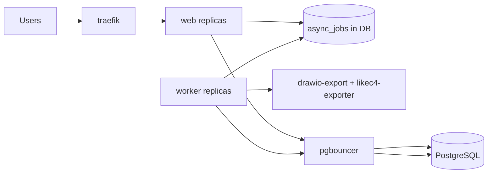
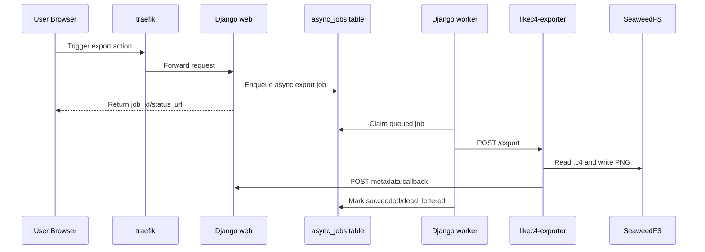
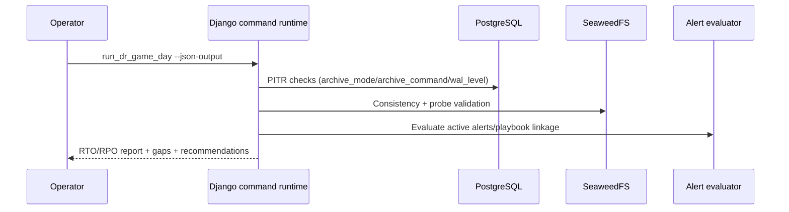

# CintaFactory Services and Interactions

This document reflects the current runtime topology, including scaled application services, monitoring services, and reliability operations.

## Services and Roles

| Service | Main role | Main outbound calls |
| --- | --- | --- |
| `traefik` | Edge reverse proxy / entrypoint in scaled topology | `web` |
| `web` (Django) | Main UI/API, health/metrics endpoints, orchestration | `pgbouncer`, `seaweedfs`, `clamav`, `drawio`, `drawio-export`, `likec4`, `likec4-exporter` |
| `worker` (Django async) | Executes async jobs (`exports.likec4`, `exports.drawio`, `exports.pdf`) | `pgbouncer`, `seaweedfs`, `clamav`, `drawio-export`, `likec4-exporter` |
| `pgbouncer` | PostgreSQL connection pooler | `db` |
| `db` (PostgreSQL) | Persistent relational data | None |
| `seaweedfs` | Object/file storage for media, diagrams, exports | None |
| `clamav` | Antivirus scanning daemon | None |
| `drawio` | draw.io editor UI | `drawio-export` |
| `drawio-export` | draw.io rendering/export worker | None |
| `likec4` | LikeC4 editor + preview service | `seaweedfs`, `web` (metadata callback) |
| `likec4-exporter` | LikeC4 PNG export worker | `seaweedfs`, `web` (metadata callback), LikeC4 CLI subprocess |
| `prometheus` | Metrics scraper and alert rule evaluator | `web` (`/metrics`), `cadvisor`, internal self-scrape |
| `cadvisor` | Container-level CPU/memory/network metrics exporter | Docker/container runtime stats |
| `loki` | Central log storage and query backend | Local TSDB/chunks storage |
| `promtail` | Docker log collector and forwarder | `loki` (`/loki/api/v1/push`) |
| `grafana` | Dashboards and ad-hoc metrics/log exploration | `prometheus`, `loki` |

## Runtime Interaction Diagram (Scaled Topology)

## Monitoring-Only Diagram

## Network Separation

The deployment uses explicit Docker networks to reduce lateral movement and exposure:

1. `edge`
- Public entrypoint network.
- Only `traefik` is attached to this network for inbound traffic.

2. `app`
- Internal application network for `web`, `worker`, exporters, and supporting services.
- Service-to-service traffic (proxying, export calls, metadata callbacks) stays here.

3. `data`
- Restricted data-plane network.
- `db` is on `data` only.
- `pgbouncer` bridges `app` <-> `data` so app services never connect directly to DB network endpoints.

4. `app_monitoring`
- Monitoring network used by `prometheus`, `grafana`, `loki`, `promtail`, and `cadvisor`.
- In this project it is configured as an external network (default name `cintaarchifactory_app`) so observability can scrape app services.

## Security Measures

Current hardening controls in the runtime and app layers:

1. Ingress and exposure controls
- Only edge service (`traefik`) publishes host ports in scaled topology.
- Internal services are private (`expose`) and reachable only through internal networks.

2. Least-privilege container profile
- `security_opt: no-new-privileges:true` on hardened services.
- `cap_drop: [ALL]` on `web`, `worker`, `likec4`, `likec4-exporter`.
- Non-root runtime for LikeC4 services (`user: APP_UID:APP_GID`).
- `read_only: true` and `tmpfs: /tmp` for LikeC4 services.

3. App and API surface protections
- Proxy hardening on draw.io and LikeC4 proxy routes (allowlists/path validation/body size limits).
- Security headers middleware and request correlation IDs.
- Token-based protection for LikeC4 metadata callback and authenticated proxying.

4. File and dependency safety
- ClamAV scan before attachment acceptance (fail-closed behavior).
- SeaweedFS interaction checks and readiness gates.
- Dependency-aware `/health/ready` prevents routing to non-ready instances.

5. Secret and policy controls
- Strict secret checks available for hardened runtime (`DJANGO_ENFORCE_STRICT_SECRETS=1`).
- CI secret scanning in workflow.

## Scalability

Scalability is implemented by separating roles and reducing bottlenecks:

1. Tier split and independent scaling
- `web` handles synchronous HTTP/UI/API traffic.
- `worker` handles asynchronous heavy jobs (`likec4`, `drawio`, `pdf` exports).
- `web` and `worker` can be scaled independently.

2. Reverse-proxy front door
- `traefik` fronts the app and provides buffering/compression/timeouts.
- Keeps app instances behind a single stable ingress.

3. Database connection pooling
- `pgbouncer` protects PostgreSQL from connection storms.
- Supports higher concurrency from scaled app/worker replicas.

4. Async queue model in DB
- Async job contract in `async_jobs` with retry and DLQ states.
- Worker pulls jobs in external-runner mode; heavy work is removed from request path.

5. Operational scaling readiness
- Health checks for `web`, `worker`, exporters, DB, and dependencies.
- Metrics + alerting + DR drills provide feedback for tuning thresholds and capacity.

## Reliability and Operations Interactions

1. `web -> /health/live`, `web -> /health/ready`
Purpose: liveness/readiness gates for routing and dependency-aware startup.

2. `web -> /metrics`
Purpose: expose Prometheus-style runtime metrics for requests, jobs, dependencies, and baseline events.

3. `worker <-> async_jobs table`
Purpose: execute queued jobs with status transitions (`queued`, `running`, `succeeded`, `dead_lettered`, etc.).

4. `run_check_runtime_alerts -> metrics + DB state`
Purpose: evaluate alert categories (queue backlog, scan failures, DB saturation, SeaweedFS errors, auth/token failures).

5. `run_backup_dr_validation -> db + seaweedfs`
Purpose: validate Postgres PITR prerequisites and SeaweedFS consistency/probe checks.

6. `run_dr_game_day -> backup validation + alert evaluation`
Purpose: game-day closure flow measuring RTO/RPO and emitting actionable gaps/recommendations.

7. `prometheus -> web/cadvisor`
Purpose: periodic scrape loop for app and container telemetry, plus alert rule evaluation.

8. `promtail -> loki`
Purpose: collect container stdout/stderr logs with Docker metadata labels and store/query in Loki.

9. `grafana -> prometheus/loki`
Purpose: dashboards and Explore workflow combining metrics and logs for incident triage.

## Key Functional Flows

