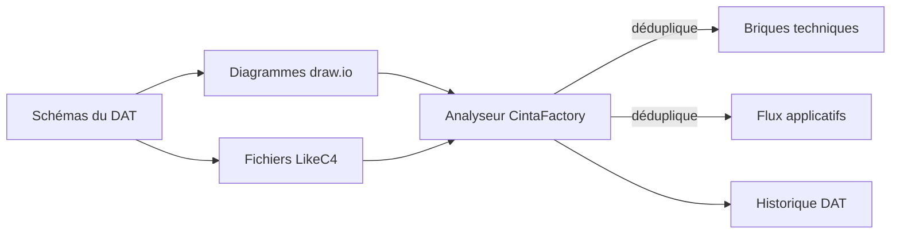
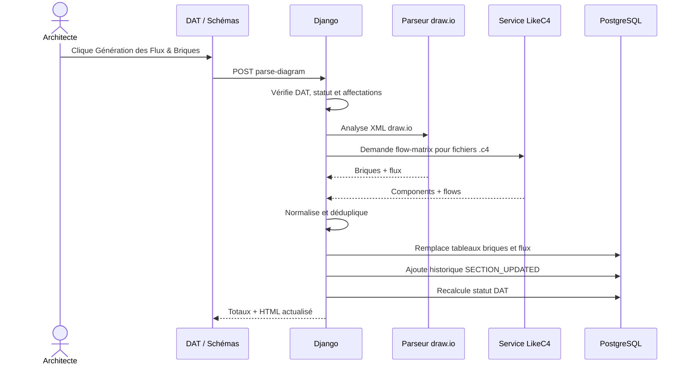

# Génération des flux applicatifs depuis draw.io et LikeC4

**Public visé :** architectes, responsables de DAT et développeurs.  
**Objectif :** définir comment CintaFactory extrait briques techniques et flux applicatifs depuis des diagrammes draw.io ou LikeC4.  
**Sources de vérité :** `dat/drawio_parser.py`, `dat/views.py`, `likec4/server.js` et `dat/config/section_blueprints.json`.  
**Dernière vérification :** 20 août 2026.

## Périmètre

Cette génération concerne section `architecture` d'un DAT :

- sous-section `schemas`, champ `schemas` : références des diagrammes sources ;
- sous-section `briques-techniques`, champ `briques` : composants détectés ;
- sous-section `flux`, champ `flux` : relations détectées.

Bouton **Génération des Flux & Briques** analyse tous diagrammes enregistrés dans sous-section `schemas`, puis reconstruit deux tableaux cibles.



## Résultat attendu

### Brique technique

| Colonne DAT | Sens | Source draw.io | Source LikeC4 |
| --- | --- | --- | --- |
| `brique_id` | Identifiant stable du composant | `idbrique` | Identifiant du composant |
| `nom` | Nom affiché | `labelbrique` | Titre, sinon identifiant |
| `description` | Description fonctionnelle/technique | `commentaire`, sinon `description` | Propriété ou métadonnée de description |

### Flux applicatif

| Colonne DAT | Sens | Remplissage automatique |
| --- | --- | --- |
| `statut` | `propose`, `valide` ou `deprecie` | Non renseigné par analyseur. |
| `flux_id` | Identifiant du flux | `idflux` draw.io ; libellé relation LikeC4. |
| `source` | Brique émettrice | Résolue depuis connexion. |
| `cible` | Brique destinataire | Résolue depuis connexion. |
| `protocole` | Protocole applicatif/transport | Attribut draw.io ou déduction libellé LikeC4. |
| `port` | Port réseau | Attribut draw.io ou nombre suivant protocole LikeC4. |
| `chiffrement` | `oui` ou `non` | `HTTPS` → `oui`, `HTTP` → `non`, sinon vide. |
| `authentification` | `oui` ou `non` | draw.io `mecanismeAuth=certificat` → `oui`, sinon vide. LikeC4 laisse vide. |

Champs laissés vides doivent être complétés manuellement dans DAT ou enrichis dans diagramme source avant nouvelle génération.

## Référencer les schémas dans le DAT

Chaque ligne de sous-section `architecture/schemas` décrit un schéma :

| Champ | draw.io | LikeC4 |
| --- | --- | --- |
| `nom_schema` | Nom lisible | Nom lisible |
| `schema_systeme` | `drawio` | `likec4` |
| `diagramme_id` | UUID du `DrawIODiagram` | Vide |
| `schema_reference` | Facultatif | Chemin SeaweedFS terminé par `.c4` |
| `description` | Contexte facultatif | Contexte facultatif |

Quand appel d'analyse ne fournit pas explicitement `diagram_ids` ou `likec4_paths`, serveur relit ces valeurs depuis tableau `schemas`.

## Source draw.io

### Format reconnu

Analyseur ne comprend pas sens visuel de formes ordinaires. Éléments exploitables doivent être des balises `<object>` avec attribut `objectType`.

Deux types reconnus, sans distinction de casse :

- `objectType="brique"` ;
- `objectType="flux"`.

Bibliothèque de formes fournie dans `static/diagrams/Symboles.xml` et `Symboles.drawio` contient objets compatibles.

### Brique draw.io

Attributs utiles :

```xml
<object
  id="component-api"
  objectType="brique"
  idbrique="APP-API"
  labelbrique="API Commandes"
  description="Expose les commandes clients"
>
  <mxCell vertex="1" parent="1" />
</object>
```

Règles :

- `id` est identifiant interne draw.io utilisé par connexions ;
- `idbrique` devient ID métier du tableau DAT ;
- `labelbrique` devient nom ;
- `commentaire` prend priorité sur `description` si présent.

### Flux draw.io

```xml
<object
  id="flow-web-api"
  objectType="flux"
  idflux="FLUX-001"
  protocole="HTTPS"
  port="443"
  mecanismeAuth="certificat"
>
  <mxCell
    edge="1"
    parent="1"
    source="component-web"
    target="component-api"
  />
</object>
```

Règles :

- `source` et `target` peuvent être portés par `<object>` ou enfant `<mxCell>` ;
- valeurs doivent viser attribut `id` de deux objets brique ;
- source/cible utilisent `labelbrique`, sinon `idbrique` ;
- `idflux`, `protocole` et `port` sont copiés ;
- protocole comparé sans casse ;
- seule valeur d'authentification `certificat` produit `oui`.

Un trait draw.io classique, sans `objectType="flux"`, reste ignoré. Une brique sans `objectType="brique"` reste ignorée.

### Documents multi-pages et compressés

Analyseur accepte :

- document `<mxGraphModel>` simple ;
- document `<mxfile>` multi-pages ;
- contenu de page XML brut, échappé ou encodé/compressé draw.io.

Limites : 8 000 000 caractères XML et 8 000 000 octets après décompression. Page invalide ou trop grande est ignorée.

## Source LikeC4

### Composants reconnus

Service LikeC4 construit matrice depuis fichier `.c4`. Parseur courant reconnaît déclarations de forme :

```likec4
component web 'Portail Web' {
  description 'Interface utilisée par les clients'
}

component api 'API Commandes' {
  metadata {
    commentaire 'Orchestre les commandes'
  }
}
```

Pour chaque `component` :

- identifiant (`web`, `api`) devient `brique_id` ;
- titre entre apostrophes devient `nom` ;
- description cherchée dans propriétés puis métadonnées avec clés `description`, `commentaire`, `details`, `notes`, `note`.

Relations peuvent référencer éléments non déclarés comme `component`. Analyseur crée alors briques minimales avec identifiant brut et description vide.

### Relations reconnues

```likec4
web -> api 'FLUX-001 HTTPS 443'
api -> database 'FLUX-002 JDBC 5432'
```

Relation doit respecter :

```text
<identifiant_source> -> <identifiant_cible> '<libellé>'
```

Guillemets simples ou doubles acceptés pour libellé.

Analyseur cherche protocole connu dans mots du libellé :

`amqp`, `ftp`, `grpc`, `http`, `https`, `imap`, `jdbc`, `ldap`, `ldaps`, `mqtt`, `nfs`, `odbc`, `pop3`, `sftp`, `smb`, `smtp`, `ssh`, `tcp`, `udp`.

Si mot suivant protocole est numérique, il devient port. Libellé complet sert aussi d'identifiant de flux quand il contient plus que protocole seul.

Convention recommandée :

```text
<ID_FLUX> <PROTOCOLE> <PORT>
```

Exemples : `FLUX-001 HTTPS 443`, `FLUX-002 AMQP 5671`, `FLUX-003 SFTP 22`.

### Matrice LikeC4

Django appelle service éditeur :

```http
GET /flow-matrix?file=diagrams/<id>/likec4.c4
X-LikeC4-Token: <LIKEC4_API_TOKEN>
```

Réponse utile :

```json
{
  "flows": [
    {"from": "web", "to": "api", "label": "FLUX-001 HTTPS 443"}
  ],
  "components": [
    {
      "name": "web",
      "title": "Portail Web",
      "props": {"description": "Interface clients"},
      "metadata": {}
    }
  ]
}
```

Fichier absent, URL éditeur invalide, erreur HTTP, JSON invalide ou service indisponible : cette source LikeC4 ne produit aucune ligne.

## Agrégation et déduplication

Tous diagrammes draw.io et fichiers LikeC4 sélectionnés sont agrégés avant écriture.

### Clé d'une brique

Priorité :

1. `brique_id` ;
2. `nom` ;
3. `description`.

### Clé d'un flux

Priorité :

1. `flux_id` ;
2. tuple `(source, cible, protocole, port)`.

Comparaison ignore casse et espaces externes. En doublon, première ligne conserve ses valeurs ; champs encore vides sont complétés depuis occurrences suivantes.

Conséquences :

- même ID doit toujours représenter même élément ;
- renommer ID crée nouvelle ligne ;
- deux flux sans ID mais même source/cible/protocole/port fusionnent ;
- ordre final suit première apparition dans sources analysées.

## Écriture dans DAT



Préconditions :

- utilisateur authentifié ;
- DAT visible par utilisateur ;
- DAT non `valider` et non `refuse` ;
- section `architecture` éditable ;
- sous-sections `schemas`, `briques-techniques` et `flux` éditables ;
- champs repeater `schemas`, `briques`, `flux` présents.

Réponse indique nombres détectés, tableaux modifiés et fragments HTML à rafraîchir.

## Attention : remplacement des données

**Génération remplace entièrement contenu actuel des tableaux `briques` et `flux`. Elle ne fusionne pas avec saisies manuelles existantes.**

Même analyse sans résultat peut vider tableaux existants. Diagrammes sources doivent donc rester référence principale avant chaque régénération.

Procédure sûre :

1. enregistrer modifications de schémas ;
2. vérifier IDs, connexions, protocoles et ports ;
3. exporter ou relire tableaux manuels utiles ;
4. lancer génération ;
5. contrôler totaux détectés ;
6. compléter champs non déductibles, notamment statut et authentification ;
7. valider section seulement après revue humaine.

## Ce qui n'est pas déduit

Analyseur ne garantit pas :

- validité réseau réelle ;
- existence DNS ou ouverture port ;
- sens métier d'une relation ;
- environnement concerné ;
- propriétaire du flux ;
- criticité, volumétrie ou fréquence ;
- statut proposé/validé/déprécié ;
- chiffrement pour protocoles autres que HTTP/HTTPS ;
- authentification LikeC4 ;
- cohérence entre plusieurs diagrammes contradictoires.

Résultat reste brouillon technique à relire, pas preuve de conformité.

## Diagnostic

| Symptôme | Cause probable | Vérification |
| --- | --- | --- |
| Aucun flux draw.io | Traits ordinaires ou `objectType` absent | Utiliser formes compatibles `brique`/`flux`. |
| Source/cible vide | `source`/`target` absents ou IDs non reliés | Vérifier IDs internes des objets. |
| Briques trouvées, flux absents | Arêtes sans objet flux | Inspecter XML et bibliothèque utilisée. |
| LikeC4 ignoré | Référence absente, non `.c4` ou outil différent | Vérifier ligne `schemas`. |
| Protocole LikeC4 vide | Libellé ne contient aucun protocole reconnu | Suivre convention ID/protocole/port. |
| Port LikeC4 vide | Port non numérique ou pas juste après protocole | Exemple : `HTTPS 443`. |
| Doublons inattendus | IDs différents ou absents | Stabiliser `brique_id` et `flux_id`. |
| Lignes fusionnées | Même ID ou même tuple de flux | Donner ID unique par flux logique. |
| Tableaux vidés | Analyse valide mais aucune donnée reconnue | Corriger schémas puis relancer. |
| Réponse 403 | Affectation insuffisante ou DAT final | Vérifier permissions section et statut DAT. |
| `missing_sections` | Blueprint DAT incomplet | Resynchroniser structure du DAT. |
| `missing_parts` | Champs `briques`/`flux` absents | Vérifier configuration sections. |

## Bonnes pratiques de modélisation

- Un ID stable et unique par brique.
- Un ID stable et unique par flux.
- Une flèche orientée source → cible.
- Protocole en nom canonique, port séparé et numérique.
- Description courte dans composant, détails longs dans DAT.
- Même vocabulaire entre draw.io, LikeC4 et tableaux DAT.
- Éviter relations implicites purement visuelles.
- Versionner/exporter schémas avant modification majeure.
- Relire résultat après chaque génération.
- Traiter diagramme comme source technique, DAT comme dossier validé.

## Évolution du parseur

Toute nouvelle donnée générée nécessite alignement de quatre contrats :

1. métadonnées draw.io ou syntaxe LikeC4 ;
2. colonnes `BRIQUE_COLUMNS` ou `FLUX_COLUMNS` ;
3. blueprint des repeaters DAT ;
4. logique de conversion et déduplication.

Ajouter colonne seulement dans interface ne suffit pas. Analyseur la laissera vide tant que mapping source n'existe pas.
