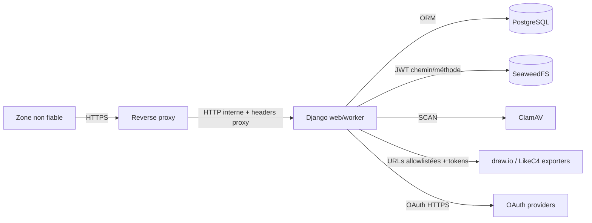

# Modèle de sécurité

**Public visé :** développeurs, exploitants, auditeurs et responsables sécurité.  
**Objectif :** expliciter actifs, frontières de confiance, contrôles et limites connues.  
**Périmètre :** application Django, API, uploads, exports, diagrammes, stockage et services internes.  
**Dernière vérification :** 20 août 2026.

Ce document décrit l'implémentation actuelle. Il ne remplace pas une analyse de risques, un test d'intrusion ou une politique `SECURITY.md`.

## Actifs à protéger

- contenu des DAT, sections, commentaires et décisions ;
- pièces jointes, diagrammes et exports ;
- comptes, rôles, groupes et permissions ;
- sessions, jetons OAuth, secrets applicatifs et clés JWT ;
- historiques, notifications et journaux d'audit ;
- disponibilité DB, stockage, scanner et workers.

## Acteurs

| Acteur | Niveau de confiance |
| --- | --- |
| Utilisateur anonyme | Non fiable. |
| Utilisateur authentifié | Identité connue ; saisies toujours non fiables. |
| Participant/responsable DAT | Autorisé seulement dans périmètre affecté. |
| Administrateur DAT | Privilégié pour un DAT, pas globalement. |
| Staff/superutilisateur/rôle admin | Fortement privilégié. |
| Reverse proxy | Fiable seulement si administré et seul accès au backend. |
| OAuth provider | Externe ; réponses validées mais données non fiables. |
| ClamAV, SeaweedFS, exporters | Services internes ; authentification réseau/jetons nécessaire. |
| Client API | Non fiable même avec jeton ; scopes et permissions restent appliqués. |

## Frontières de confiance

Services internes ne doivent pas être publiés directement en production. Entrée publique normale passe par reverse proxy et Django.

## Authentification

### Interface

- session Django ;
- login/mot de passe Django ;
- fournisseurs OAuth configurés ;
- vérification `state` OAuth avant échange du code ;
- mot de passe inutilisable pour compte créé sans mot de passe explicite.

### API

- session Django avec CSRF pour méthodes dangereuses ;
- OAuth2 Bearer via `django-oauth-toolkit` ;
- permissions Django par action.

`OAuthAccount` stocke access token, refresh token et profil brut. Chiffrement applicatif de ces colonnes n'est pas visible dans modèle actuel : protection repose sur DB, sauvegardes, accès administratifs et chiffrement infrastructure. Toute exportation DB doit être traitée comme secret.

## Autorisation

Règles détaillées dans [Permissions.md](Permissions.md).

Principes actuels :

- filtrer DAT selon propriétaire, participant ou responsable de groupe ;
- droits de section par affectation explicite ;
- revue par administrateur global ou rôles de revue affectés ;
- diagrammes draw.io limités au propriétaire ;
- jobs utilisateurs filtrés par demandeur ;
- actions opérateur jobs réservées staff/superutilisateur.

### Limite API connue

Querysets REST DAT et applications ne reprennent pas le filtre « Mes DAT ». La permission globale `dat.view_dat` autorise le queryset complet exposé par API. Valider ce choix avant donner cette permission à un rôle non administratif.

`UserSerializer` autorise aussi écriture de `is_staff` et `is_superuser` sous seule permission `users.change_user`. Ne pas déléguer cette permission à un administrateur limité avant ajout d'une autorisation de champ ou sérialiseur séparé.

Contrôles API de détail appellent des permissions objet. Backend Django standard ne les implémente pas : comportement liste et comportement détail peuvent diverger. Définir explicitement backend/politique objet avant dépendre de ces endpoints.

## Entrées HTTP et navigateur

Middleware applique :

- CSP ;
- `X-Content-Type-Options: nosniff` ;
- `Referrer-Policy` ;
- `X-Frame-Options: SAMEORIGIN` ;
- `Cross-Origin-Opener-Policy` ;
- ID de requête ;
- limitation de débit.

Mode strict active redirection HTTPS, HSTS et cookies sécurisés. Vérifications système peuvent bloquer configuration faible en production.

Éditeur LikeC4 reçoit une CSP plus permissive (`http`, `https`, WebSocket, `unsafe-inline`, `unsafe-eval`) pour fonctionner. Cette route doit rester authentifiée et isolée ; réduire cette exception si intégration le permet.

## CSRF, redirections et proxy

- CSRF trusted origins dérivées des hôtes autorisés ou configurées explicitement.
- En mode strict, seules origines HTTPS sont ajoutées dynamiquement.
- `X-Forwarded-Proto` est honoré pour reconnaître HTTPS derrière proxy.
- Paramètre OAuth `next` est conservé puis utilisé après connexion ; toute évolution doit garantir redirection locale sûre.

Implémentation actuelle ne montre pas de validation locale de `next` avant `redirect(next_url)`. Traiter ce point comme risque de redirection ouverte : n'accepter que hôte/schéma autorisé, idéalement chemin local validé.

Backend doit être inaccessible directement si sécurité dépend d'en-têtes fournis par proxy. Proxy doit écraser, pas seulement transmettre, `X-Forwarded-*` venant d'Internet.

## Limitation de débit

Deux sources :

- `conf/limit.json` pour application et API ;
- `ENDPOINT_RATE_LIMIT_PER_IP_PER_MINUTE` pour endpoints sensibles (imports, exports, uploads, proxies).

Adresse client prend première valeur de `X-Forwarded-For`. Cette valeur est fiable seulement si proxy contrôlé nettoie en-tête.

Cache Django distribué n'est pas configuré dans `settings.py`. Avec cache mémoire par processus, limites ne sont pas globales entre plusieurs instances web. Utiliser backend partagé avant considérer rate limit comme contrôle anti-abus distribué.

## Uploads

Contrôles appliqués avant stockage définitif :

1. authentification, visibilité DAT, état non final et affectation section ;
2. limite de taille globale puis limite pièce jointe ;
3. nettoyage du nom et suppression chemin/NUL ;
4. allowlist d'extensions ;
5. cohérence du MIME déclaré ;
6. scan ClamAV ;
7. chemin serveur aléatoire ;
8. stockage SeaweedFS puis métadonnées DB.

Scanner timeout, indisponible, fichier inaccessible, virus ou réponse inconnue : refus fermé.

### Quarantaine

Fichiers rejetés peuvent être copiés sous `dat_attachments_quarantine/<raison>/...` si quarantaine activée et taille admissible. Considérer ces objets hostiles :

- aucun service ne doit les exécuter ou afficher inline ;
- accès réservé aux opérateurs sécurité ;
- rétention et purge à définir ;
- ne pas exposer chemin de quarantaine à utilisateur non privilégié ;
- scanner sauvegardes contenant quarantaine.

Réponse AJAX actuelle peut inclure `quarantine_path` dans `failure_states`. Supprimer ce détail ou limiter réponse aux opérateurs ; chemin interne n'est pas nécessaire à utilisateur final.

Contrôle MIME repose sur valeur déclarée par client, pas détection de contenu. ClamAV reste contrôle de contenu principal ; formats actifs Office/PDF/SVG restent potentiellement dangereux côté poste client.

## Stockage

SeaweedFS reçoit JWT HS256 limités :

- préfixe de chemin ;
- méthode HTTP ;
- durée courte.

Clés lecture et écriture sont distinctes. URLs publiques peuvent porter JWT en query string ; elles risquent fuite via logs, historique navigateur ou Referer. TTL court et `Referrer-Policy` réduisent risque, sans l'annuler.

Services Node normalisent chemins et refusent traversal, segments `.`/`..`, chemins absolus et certaines syntaxes ambiguës. Répertoires temporaires LikeC4 utilisent permissions privées et rejettent liens symboliques au niveau racine configurée.

## Proxies draw.io et LikeC4

Contrôles importants :

- chemin relatif uniquement ;
- rejet `..`, backslash, NUL et URL absolue ;
- préfixes de chemins configurables ;
- hôte amont allowlisté ;
- absence de credentials dans URL amont ;
- limites de taille ;
- authentification Django sur routes utilisateur ;
- token partagé pour API/callbacks LikeC4.

Toute nouvelle URL amont doit être ajoutée explicitement. Ne jamais construire une requête sortante depuis URL complète fournie par utilisateur.

## Exports

Double approbation : deux administrateurs DAT explicites, approbateurs distincts, cinq minutes pour approuver, accès d'une heure, journalisation des téléchargements.

### Limite de couverture connue

Contrôle `can_download_export()` protège actuellement export JSON et téléchargement PDF mis en cache. Endpoint direct de génération PDF (`.../export/pdf/generate/`, ainsi que son alias historique) génère une réponse PDF sans appeler ce contrôle. Déclenchement asynchrone crée aussi document avant contrôle de téléchargement.

Ne pas présenter double approbation comme protection complète tant que toutes routes PDF ne passent pas par même garde centralisée. Restreindre ou corriger ces routes avant usage avec données nécessitant double contrôle.

## Secrets

Secrets minimum :

- `DJANGO_SECRET_KEY` ;
- mots de passe DB/SMTP ;
- clients OAuth ;
- `LIKEC4_METADATA_TOKEN`, `LIKEC4_API_TOKEN` ;
- clés JWT SeaweedFS ;
- webhooks.

Règles :

- gestionnaire de secrets ou secrets CI, jamais dépôt ;
- valeur différente par environnement et fonction ;
- rotation avec procédure testée ;
- minimum 32 caractères aléatoires pour clés SeaweedFS ;
- ne jamais imprimer secret ni payload d'autorisation ;
- invalider jetons après suspicion de fuite.

Segment URL admin configurable n'est qu'une réduction de bruit. Il ne remplace pas authentification, MFA, filtrage réseau ou permissions.

## Journalisation et audit

Logs structurés incluent request ID. Historique DAT conserve acteur affiché et détails. Export sécurisé conserve demandes, approbations, accès et téléchargements.

Ne pas logger :

- mots de passe ;
- cookies/session IDs ;
- Authorization headers ;
- tokens OAuth/LikeC4/SeaweedFS ;
- contenu de fichier ;
- données personnelles non nécessaires.

Adresse email apparaît actuellement dans log de succès OAuth. Traiter logs comme données personnelles, limiter rétention et accès.

En cas de callback OAuth avec `state` invalide, log actuel inclut valeurs attendue et reçue. Éviter journalisation de ces valeurs de session ; garder fournisseur, request ID et motif générique.

## Disponibilité

Readiness vérifie DB, table jobs, SeaweedFS, ClamAV et exporters. Upload échoue fermé sans antivirus. Jobs utilisent idempotence, retries et dead-letter.

`/health/live`, `/health/ready` et `/metrics` n'ont pas de garde d'authentification dans routes actuelles. Reverse proxy doit décider lesquels exposer publiquement. Readiness révèle état des dépendances ; métriques peuvent révéler topologie et charge.

Menaces de saturation à surveiller :

- uploads volumineux ou nombreux ;
- génération PDF/diagrammes coûteuse ;
- files jobs sans backpressure ;
- cache rate-limit local lors du scaling ;
- stockage quarantaine sans politique de purge.

## Checklist avant mise en production

- Exposition publique limitée au reverse proxy.
- TLS valide ; modes stricts activés.
- `DEBUG=False` ; aucun secret factice.
- Réseau DB et services internes non publié.
- Permissions API auditées par rôle.
- Routes d'export unifiées sous même contrôle.
- Proxy nettoie `Forwarded`, `X-Forwarded-*`, request IDs trop longs et host.
- Cache partagé pour rate limiting multi-instance.
- Quarantaine isolée, accès/purge définis.
- Sauvegardes chiffrées et restauration testée.
- Rotation secrets et révocation OAuth documentées.
- Logs, métriques et alertes sans secrets.
- Tests d'autorisation objet couvrent accès croisés entre utilisateurs.

## Réponse à incident

En cas de suspicion :

1. conserver request IDs, horodatages et journaux utiles ;
2. révoquer sessions et jetons concernés ;
3. faire rotation du secret exposé ;
4. isoler fichiers/quarantaine sans les ouvrir ;
5. vérifier historique DAT/export et accès SeaweedFS ;
6. corriger cause puis valider absence de voie équivalente ;
7. documenter impact, données touchées et actions de prévention.
