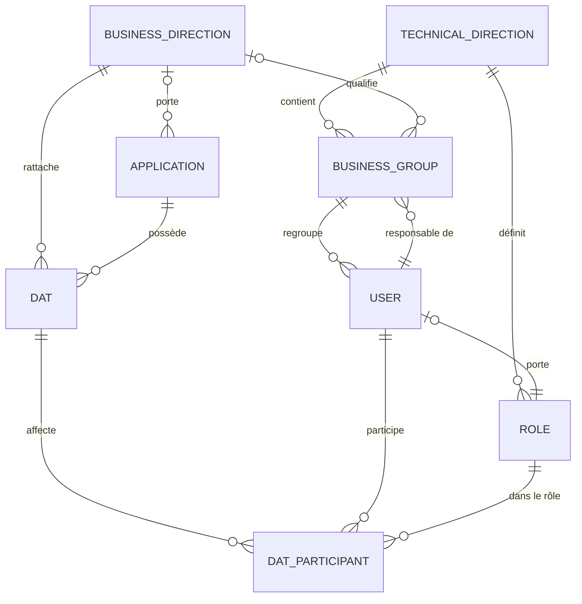

# Directions techniques et organisation des utilisateurs

**Public visé :** administrateurs fonctionnels, responsables d'équipe et développeurs.  
**Objectif :** expliquer le modèle organisationnel utilisé pour affecter rôles, groupes et responsabilités.  
**Sources de vérité :** `users/models.py`, `dat/models.py` et `dat/permissions.py`.  
**Dernière vérification :** 19 août 2026.

## Vue d'ensemble

CintaFactory sépare deux axes :

- **direction technique** : rattachement des rôles et groupes qui réalisent ou valident le travail technique ;
- **direction métier** : rattachement fonctionnel de l'application et du DAT.

Un groupe métier relie ces axes. Il appartient toujours à une direction technique et peut être associé à une direction métier.



## Direction technique

`TechnicalDirection` possède un UUID, un nom unique et un slug unique.

Lors de son enregistrement, l'application tente de garantir l'existence d'un groupe par défaut :

1. si un groupe par défaut existe déjà, aucune action ;
2. sinon, choix du premier superutilisateur disponible ;
3. à défaut, choix du premier utilisateur disponible ;
4. si aucun utilisateur n'existe, aucun groupe n'est créé ;
5. création d'un groupe nommé `<direction> - Groupe par défaut`.

Une contrainte base de données autorise au maximum un groupe `is_default=True` par direction technique.

## Direction métier

`BusinessDirection` possède un UUID, un nom unique et un slug unique.

Elle peut être liée à :

- plusieurs applications ;
- plusieurs groupes métier, tant que le couple direction métier/direction technique reste unique ;
- plusieurs DAT.

La direction métier d'un DAT n'est pas choisie indépendamment : `DAT.save()` la resynchronise depuis l'application liée. Modifier la direction métier d'une application ne met donc à jour un DAT existant qu'à son prochain enregistrement.

## Groupe métier

`BusinessGroup` contient :

| Champ | Règle |
| --- | --- |
| `name` | Unique. |
| `direction` | Direction technique obligatoire, suppression protégée. |
| `responsible` | Utilisateur responsable obligatoire, suppression protégée. |
| `is_default` | Au plus un groupe par défaut par direction technique. |
| `business_direction` | Direction métier facultative. |

Pour une direction métier donnée, une même direction technique ne peut posséder qu'un groupe associé. Cette contrainte évite deux groupes concurrents pour le même croisement organisationnel.

Le responsable d'un groupe peut voir les DAT auxquels un membre du groupe participe. Ce droit de visibilité ne donne pas automatiquement le droit de modifier toutes les sections du DAT.

## Rôle

`Role` possède un nom unique, un slug unique, une direction technique facultative et le marqueur `is_admin_role`.

Règles :

- rôle technique avec direction : utilisateur obligatoirement placé dans un groupe de la même direction ;
- rôle sans direction : utilisateur ne peut pas être placé dans un groupe métier ;
- rôle administrateur : normalement sans direction technique ;
- slug `admin` : reconnu comme administrateur global dans les contrôles DAT actuels.

Rôles attendus par le workflow DAT :

| Slug | Libellé métier |
| --- | --- |
| `porteur-demande` | Porteur de la demande |
| `architecte-referent` | Architecte référent |
| `architecte-technique` | Architecte technique |
| `urbaniste` | Urbaniste |
| `analyste-secu` | Analyste sécurité |
| `rssi` | RSSI |
| `comite-validation` | Comité de validation |
| `infra-exploitation` | Infra / Exploitation |

Ces slugs sont des identifiants stables. Modifier un slug sans adapter les constantes et définitions de workflow casse les affectations attendues.

## Utilisateur

Chaque utilisateur possède au plus un rôle et un groupe métier.

À l'enregistrement :

- si des rôles existent, un nouvel utilisateur doit en avoir un ;
- sans rôle explicite, l'application tente de choisir le premier rôle de la direction du groupe, sinon le premier rôle global ;
- avec un rôle technique mais sans groupe, l'application tente d'affecter le groupe par défaut de cette direction ;
- rôle et groupe doivent appartenir à la même direction technique ;
- un utilisateur créé sans mot de passe explicite reçoit un mot de passe inutilisable.

La propriété `user.business_direction` est dérivée de `user.business_group.business_direction`.

## Affectations dans un DAT

### Participant DAT

`DATParticipant` relie un DAT, un rôle et un utilisateur. Contraintes :

- un rôle unique par DAT ;
- un utilisateur unique par DAT ;
- suppression du rôle ou de l'utilisateur protégée ;
- suppression du DAT en cascade.

### Responsable et participant de section

Chaque section accepte au plus :

- un `DATSectionResponsible` explicite ;
- un `DATSectionParticipant` explicite.

L'édition d'une section repose sur ces affectations explicites. Les rôles autorisés servent à construire et valider les choix d'affectation ; ils ne remplacent pas l'affectation utilisateur.

Certaines sections forcent un rôle responsable lors de l'inférence initiale :

- `architecture` → `architecte-referent` ;
- `cybersecurite` → `rssi`.

### Administrateur DAT

`DATAdmin` ajoute un droit d'administration limité à un DAT. Le propriétaire et les administrateurs globaux sont aussi reconnus par `user_is_dat_admin_for_dat()`.

Seul un administrateur de ce DAT peut modifier les responsables de section et gérer les administrateurs DAT. Les candidats à la promotion proviennent du propriétaire, des participants et des responsables de section.

## Exemple

```text
Direction technique : Architecture
├── Rôle : architecte-referent
├── Rôle : urbaniste
└── Groupe : Architecture - Paiements
    ├── Direction métier : Finance
    ├── Responsable : Alice
    ├── Bob (architecte-referent)
    └── Chloé (urbaniste)

Application : Paiement Mobile
└── Direction métier : Finance
    └── DAT : DAT-2026-0042
        ├── Propriétaire : David
        ├── Participant architecte-referent : Bob
        └── Responsable section architecture : Bob
```

Alice peut voir le DAT si Bob y participe, car elle est responsable du groupe de Bob. Bob peut éditer la section architecture seulement s'il y est explicitement affecté.

## Points de vigilance

- Ne pas utiliser nom affiché comme identifiant : utiliser slug ou UUID.
- Ne pas supprimer une direction, un groupe, un rôle ou utilisateur encore référencé ; plusieurs relations utilisent `PROTECT`.
- Ne pas confondre direction métier et groupe métier.
- Ne pas confondre responsable de groupe, participant DAT, responsable de section et administrateur DAT.
- Tester toute modification de slug contre [Workflow.md](Workflow.md) et [Permissions.md](Permissions.md).
